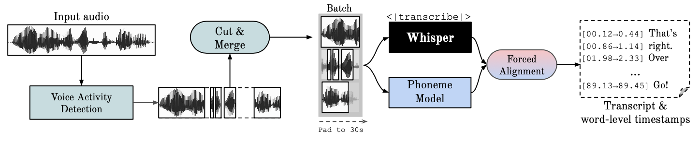

<h1 align="center">WhisperX</h1>

<p align="center">
  <a href="https://github.com/m-bain/whisperX/stargazers">
    
  </a>
  <a href="https://github.com/m-bain/whisperX/issues">
        
  </a>
  <a href="https://github.com/m-bain/whisperX/blob/master/LICENSE">
        
  </a>
  <a href="https://twitter.com/intent/tweet?text=&url=https%3A%2F%2Fgithub.com%2Fm-bain%2FwhisperX">
  
  </a>      
</p>

<p align="center">
  <a href="#what-is-it">What is it</a> •
  <a href="#setup">Setup</a> •
  <a href="#example">Usage</a> •
  <a href="#other-languages">Multilingual</a> •
  <a href="#contribute">Contribute</a> •
  <a href="EXAMPLES.md">More examples</a> •
  <a href="https://arxiv.org/abs/2303.00747">Paper</a>
</p>





<p align="left">Whisper-Based Automatic Speech Recognition (ASR) with improved timestamp accuracy using forced alignment.

</p>


<h2 align="left", id="what-is-it">What is it 🔎</h2>

This repository refines the timestamps of openAI's Whisper model via forced aligment with phoneme-based ASR models (e.g. wav2vec2.0) and VAD preprocesssing, multilingual use-case.


**Whisper** is an ASR model [developed by OpenAI](https://github.com/openai/whisper), trained on a large dataset of diverse audio. Whilst it does produces highly accurate transcriptions, the corresponding timestamps are at the utterance-level, not per word, and can be inaccurate by several seconds.

**Phoneme-Based ASR** A suite of models finetuned to recognise the smallest unit of speech distinguishing one word from another, e.g. the element p in "tap". A popular example model is [wav2vec2.0](https://huggingface.co/facebook/wav2vec2-large-960h-lv60-self).

**Forced Alignment** refers to the process by which orthographic transcriptions are aligned to audio recordings to automatically generate phone level segmentation.

**Voice Activity Detection (VAD)** is the detection of the presence or absence of human speech.

<h2 align="left", id="highlights">New🚨</h2>

- v2 released, code cleanup, imports whisper library, batched inference from paper not included (contact for licensing / batched model API). VAD filtering is now turned on by default, as in the paper.
- Paper drop🎓👨‍🏫! Please see our [ArxiV preprint](https://arxiv.org/abs/2303.00747) for benchmarking and details of WhisperX. We also introduce more efficient batch inference resulting in large-v2 with *60-70x REAL TIME speed (not provided in this repo).
- VAD filtering: Voice Activity Detection (VAD) from [Pyannote.audio](https://huggingface.co/pyannote/voice-activity-detection) is used as a preprocessing step to remove reliance on whisper timestamps and only transcribe audio segments containing speech. add `--vad_filter True` flag, increases timestamp accuracy and robustness (requires more GPU mem due to 30s inputs in wav2vec2)
- Character level timestamps (see `*.char.ass` file output)
- Diarization (still in beta, add `--diarize`)


<h2 align="left" id="setup">Setup ⚙️</h2>
Install this package using

`pip install git+https://github.com/m-bain/whisperx.git`

If already installed, update package to most recent commit

`pip install git+https://github.com/m-bain/whisperx.git --upgrade`

If wishing to modify this package, clone and install in editable mode:
```
$ git clone https://github.com/m-bain/whisperX.git
$ cd whisperX
$ pip install -e .
```

You may also need to install ffmpeg, rust etc. Follow openAI instructions here https://github.com/openai/whisper#setup.


### Setup not working???
Safest to use install pytorch as follows (for gpu)

`conda install pytorch==1.11.0 torchvision==0.12.0 torchaudio==0.11.0 -c pytorch
`


### Speaker Diarization
To **enable Speaker. Diarization**, include your Hugging Face access token that you can generate from [Here](https://huggingface.co/settings/tokens) after the `--hf_token` argument and accept the user agreement for the following models: [Segmentation](https://huggingface.co/pyannote/segmentation) , [Voice Activity Detection (VAD)](https://huggingface.co/pyannote/voice-activity-detection) , and [Speaker Diarization](https://huggingface.co/pyannote/speaker-diarization)


<h2 align="left" id="example">Usage 💬 (command line)</h2>

### English

Run whisper on example segment (using default params)

    whisperx examples/sample01.wav


For increased timestamp accuracy, at the cost of higher gpu mem, use bigger models (bigger alignment model not found to be that helpful, see paper) e.g.

    whisperx examples/sample01.wav --model large-v2 --align_model WAV2VEC2_ASR_LARGE_LV60K_960H

Result using *WhisperX* with forced alignment to wav2vec2.0 large:

https://user-images.githubusercontent.com/36994049/208253969-7e35fe2a-7541-434a-ae91-8e919540555d.mp4

Compare this to original whisper out the box, where many transcriptions are out of sync:

https://user-images.githubusercontent.com/36994049/207743923-b4f0d537-29ae-4be2-b404-bb941db73652.mov

### Other languages

The phoneme ASR alignment model is *language-specific*, for tested languages these models are [automatically picked from torchaudio pipelines or huggingface](https://github.com/m-bain/whisperX/blob/e909f2f766b23b2000f2d95df41f9b844ac53e49/whisperx/transcribe.py#L22).
Just pass in the `--language` code, and use the whisper `--model large`.

Currently default models provided for `{en, fr, de, es, it, ja, zh, nl, uk, pt}`. If the detected language is not in this list, you need to find a phoneme-based ASR model from [huggingface model hub](https://huggingface.co/models) and test it on your data.


#### E.g. German
    whisperx --model large --language de examples/sample_de_01.wav

https://user-images.githubusercontent.com/36994049/208298811-e36002ba-3698-4731-97d4-0aebd07e0eb3.mov


See more examples in other languages [here](EXAMPLES.md).

## Python usage  🐍

```python
import whisperx
import whisper

device = "cuda" 
audio_file = "audio.mp3"

# transcribe with original whisper
model = whisper.load_model("large", device)
result = model.transcribe(audio_file)

print(result["segments"]) # before alignment

# load alignment model and metadata
model_a, metadata = whisperx.load_align_model(language_code=result["language"], device=device)

# align whisper output
result_aligned = whisperx.align(result["segments"], model_a, metadata, audio_file, device)

print(result_aligned["segments"]) # after alignment
print(result_aligned["word_segments"]) # after alignment
```


<h2 align="left" id="whisper-mod">Whisper Modifications</h2>

In addition to forced alignment, the following two modifications have been made to the whisper transcription method:

1. `--condition_on_prev_text` is set to `False` by default (reduces hallucination)

<h2 align="left" id="limitations">Limitations ⚠️</h2>

- Whisper normalises spoken numbers e.g. "fifty seven" to arabic numerals "57". Need to perform this normalization after alignment, so the phonemes can be aligned. Currently just ignores numbers.
- If setting `--vad_filter False`, then whisperx assumes the initial whisper timestamps are accurate to some degree (within margin of 2 seconds, adjust if needed -- bigger margins more prone to alignment errors)
- Overlapping speech is not handled particularly well by whisper nor whisperx
- Diariazation is far from perfect.


<h2 align="left" id="contribute">Contribute 🧑‍🏫</h2>

If you are multilingual, a major way you can contribute to this project is to find phoneme models on huggingface (or train your own) and test them on speech for the target language. If the results look good send a merge request and some examples showing its success.

The next major upgrade we are working on is whisper with speaker diarization, so if you have any experience on this please share.

<h2 align="left" id="coming-soon">Coming Soon 🗓</h2>

* [x] Multilingual init

* [x] Subtitle .ass output

* [x] Automatic align model selection based on language detection

* [x] Python usage

* [x] Character level timestamps

* [x] Incorporating  speaker diarization

* [ ] Automatic .wav conversion to make VAD compatible

* [ ] Model flush, for low gpu mem resources

* [ ] Improve diarization (word level). *Harder than first thought...*


<h2 align="left" id="contact">Contact/Support 📇</h2>

Contact maxhbain@gmail.com for queries and licensing / early access to a model API with batched inference (transcribe 1hr audio in under 1min).

<a href="https://www.buymeacoffee.com/maxhbain" target="_blank"></a>


<h2 align="left" id="acks">Acknowledgements 🙏</h2>

This work, and my PhD, is supported by the [VGG (Visual Geometry Group)](https://www.robots.ox.ac.uk/~vgg/) and the University of Oxford.


Of course, this is builds on [openAI's whisper](https://github.com/openai/whisper).
And borrows important alignment code from [PyTorch tutorial on forced alignment](https://pytorch.org/tutorials/intermediate/forced_alignment_with_torchaudio_tutorial.html)


<h2 align="left" id="cite">Citation</h2>
If you use this in your research, please cite the paper:

```bibtex
@article{bain2022whisperx,
  title={WhisperX: Time-Accurate Speech Transcription of Long-Form Audio},
  author={Bain, Max and Huh, Jaesung and Han, Tengda and Zisserman, Andrew},
  journal={arXiv preprint, arXiv:2303.00747},
  year={2023}
}
```

as well the following works, used in each stage of the pipeline:

```bibtex
@article{radford2022robust,
  title={Robust speech recognition via large-scale weak supervision},
  author={Radford, Alec and Kim, Jong Wook and Xu, Tao and Brockman, Greg and McLeavey, Christine and Sutskever, Ilya},
  journal={arXiv preprint arXiv:2212.04356},
  year={2022}
}
```

```bibtex
@article{baevski2020wav2vec,
  title={wav2vec 2.0: A framework for self-supervised learning of speech representations},
  author={Baevski, Alexei and Zhou, Yuhao and Mohamed, Abdelrahman and Auli, Michael},
  journal={Advances in neural information processing systems},
  volume={33},
  pages={12449--12460},
  year={2020}
}
```

```bibtex
@inproceedings{bredin2020pyannote,
  title={Pyannote. audio: neural building blocks for speaker diarization},
  author={Bredin, Herv{\'e} and Yin, Ruiqing and Coria, Juan Manuel and Gelly, Gregory and Korshunov, Pavel and Lavechin, Marvin and Fustes, Diego and Titeux, Hadrien and Bouaziz, Wassim and Gill, Marie-Philippe},
  booktitle={ICASSP 2020-2020 IEEE International Conference on Acoustics, Speech and Signal Processing (ICASSP)},
  pages={7124--7128},
  year={2020},
  organization={IEEE}
}
```
